<!--pandoc  --toc -V lang:en -H templates/includeHeader.pandoc -B templates/includeBefore.pandoc -A templates/includeAfter.pandoc  -s -c styles/normalize.css -c styles/styles.css -c styles/print.css -c styles/autoToc.css  -t html5 -o index.html guideVisualResearchMetadata.yaml guideVisualResearch.md
 --->

## A different way to find user needs

A common method for finding user needs is [interviewing and observing users](http://jdittrich.github.io/userNeedResearchBook/). I saw many people struggle with it: There is much to be kept in mind (questions, goals, past answers, recording…) to do it in practice, it is easy slip into constraining questions instead of exploring new ideas and doing research may not feel like getting something done.

I thought of a way of researching user needs with a methods that enables beginners and can be used by more experiences researches too. I knew that many people benefit from graphical scaffolds like the Business Model Canvas or User Experience Maps. But these are used to structure results or assumptions. What if we would use such mapping techniques to gather data in the first place?

Doing so would provide a scaffold for doing the research, it may help to focus on the users and not on features and having a shared visual reference helps participant and researcher alike to structure the research. Here, I show how I use such visual methods.

The method I demonstrate here will still involve asking questions and observing users. However, the data gathering revolves around documenting experiences with sketches and notes on paper. While the participants notes and sketches will be an important part of the sketches, the researcher adds to them too: To make the information comprehensible to us we will ask questions and add supplementing information like additional notes and sketches.

### Related concepts

Graphical representations are often in the design process, for example as user journey maps or service blueprints [^Kalbach2016]. In contrast to the methods demonstrated here, these diagrams are typically created *after* the user research and serve less for data gathering and analysis but for showing research results and for helping teams to find a common vision. 

For data gathering and analysis graphical methods have been used for research on social structures of families [^Harold2015], research on reproductive health [^Kesby2000], drug recovery therapy  [^Czuchry1995] and psychotherapy [^Mattaini1993]. It maybe a reasonable objection that diagramming is more difficult for people than being interviewed, however, there is evidence that e.g. pupil with a low verbal ability can benefit from instructional diagrams in learning [^Nesbit2006], and Node-Link style diagrams have been used in a teaching context with »fourth- and fifth-grade students« [^Chung1999] and even – with adult support – in preschool [^Cassata2006]. Thus, despite of the abstraction needed to create a node-link-map, it seems to be an accessible method for participants.

## Get ready

### Drawing equipment
Like with other forms of user research, we need to make some preparations for our research session. You should in mind what you want to find out. Since we are going to do *Visual* User Need Research we need some supplies to enable the participant and us to visualize experiences. We do this by using pen and paper and guiding the participant to draw sketches and notes. To make this easier we prepare some templates to scaffold gathering the data on common questions. Templates for the most common tasks can be found at the [appendix](#appendix). There you can find advice on creating custom templates, too.

### Cheat sheet

You can as well write down some questions on a cheat sheet you want to ask or points to focus on. If make additional notes you can do it on the same sheet.

If you write down questions, focus on »how« or »why«- Questions: So called »open questions« – they don't suggest a particular answer. You should avoid »closed questions«, questions that can be answered simply with »yes« or »no«. We ask open questions, since they give us new information, and encourage the participant to draw and write about processes and reasons.

> Open questions would be:
>
> »Describe how you started your work today« or
> »Why do you start by turning the machine on?«

## Start the Research Session

### Intro
Before the interview starts, you set up the participant. This includes greeting, explaining what your research is about and asking for the participants consent to participate

> „We are going to document your […whatever process you are interested in…] together so that I can understand […aspects of it…] better. We will do this mainly by writing and drawing on paper. Sometimes I may not understand things since I am new to your field, so I may ask questions, add notes to the paper or ask for a demonstration.

Many people don’t like drawing since they think they are expected to produce artworks or accurate sketches. 

> »When I say documenting by drawing and writing, it does not mean that we are going to produce an artwork here. This is what the end result may look like« 

Show an example from an unrelated area of research  so they can easily grasp what you are going for since participants be unsure of that [^questionsUmoquit] [^Umoquit2011]. 

They also might think that you do some sort of test if they do things »right«, so it makes sense to clarify that you are not testing them: 

> I am interested in how you work and why you do it the way you do. This is not some sort of test and there is no wrong and right. 

<!-- 
Support  for showing examples: The efficiency and effectiveness of utilizing diagrams in interviews, Umoquit et.al, 2008: Participants had questions in regard of what they should/can do (31% if the participants) when being interviewed with the "Participatory Diagramming" method, which is similar to what is shown here. 
-->

## Document and Explore

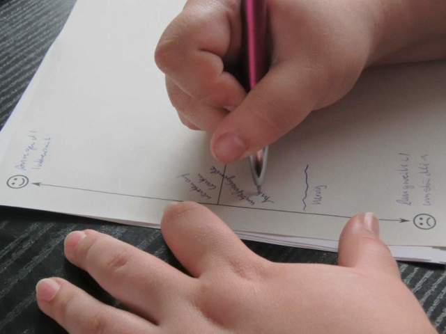

### Explain the current template and research interest
Start off with whatever you consider the easiest for the participant. Explain the template and how it is used and show an example or make a little sketch demonstrating its use. Give the participant a pencil or a felt pen (I use black).

### Interact
In the beginning the participant may ask things like »is this right?«. Encourage them to continue:

> Yes!

Sometimes participants need to be reminded to add comments to their drawings

> Great – could you help me to understand the diagram when I look at it later on by writing in  some comments?

If you don’t understand something, or want to know more about a specific topic ask as well:

> You said you need to  ›Setting yourself up‹ - what does it mean?

or

> »This gap here [Point to it] – what does this indicate?«

This asking of questions is as well helpful if participants concentrate solely on drawing and don’t provide additional information by talking along while they draw.

If possible, you should ask for demonstrations. It is great if the participant describes something, it is even better if you see it first hand. To remember what you can draw a sketch, add notes and/or make a photograph

### Flow of interaction when using a template

When the participants draw and talk there is usually a sequence: After they understood the diagram they tend to draw and talk much. At some point they drew and said what they consider important and say less. This is a good moment to take a close look at the diagram and the annotations. Do you understand everything? Do you feel there is any information missing? Usually there is, even though the participant may feel that the important things are noted already. So start to ask questions, encourage the participant to sketch how spaces or devices they referred to look like or add your own notes on the diagram with the answers of the participant.

### Recording Information

To add these informations, the participant can write them into the diagram. As well, you can add your own notes and sketches to the diagram to annotate and clarify what is already drawn and written. Just use a different color, so you can distinguish between the participants.

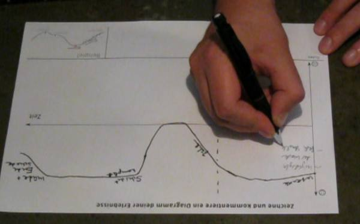

In particular, if the sheet of paper is already quite full you can as well just write Numbers on the diagram and then refer to these points on another sheet of paper. So you write »I.« on the template and on the additional sheet you write »I: This means that [explain]«

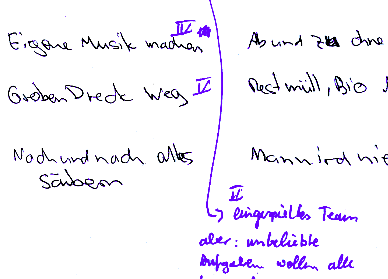

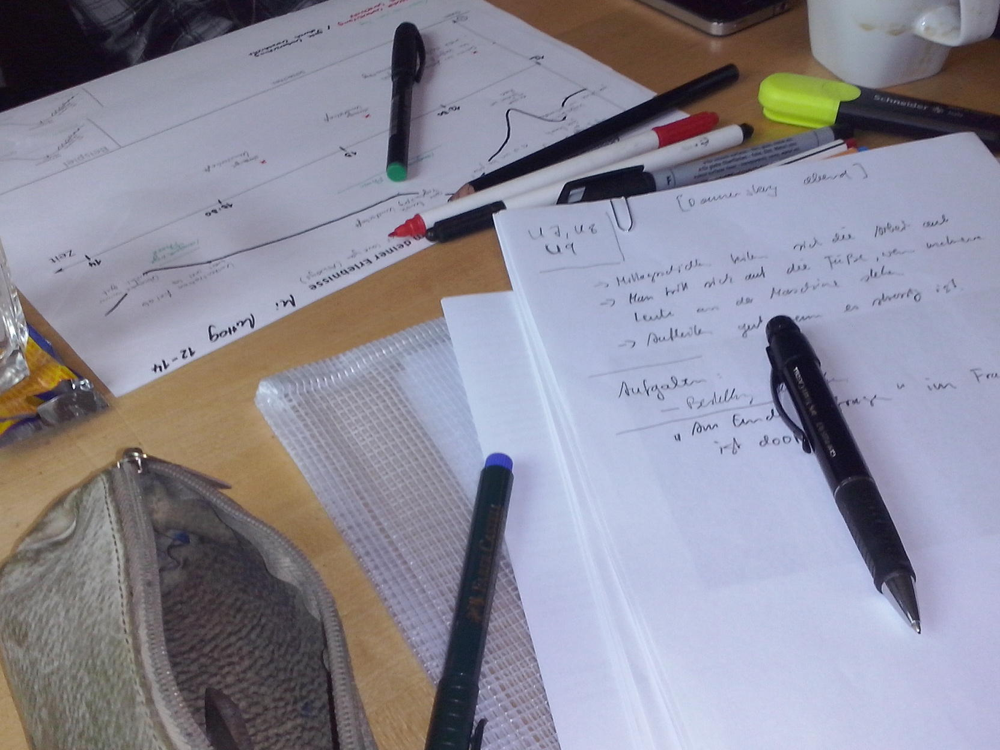

Another kind of recording is separate from the diagrams. In particular to remember to get back to specific topics and to note questions which come into your mind you can write your own notes. It makes sense as well to record your conversation with the participant. Naturally not everything goes on the diagram, only the most important things. But since it is possible that something seemingly trivial turns out to be important or that you find something particularly interesting it makes sense to use a voice recorder with the consent of the participant.

### Managing the flow between topics and templates over the course of the session

When you feel that you got enough information from a particular perspective you can transition to another perspective. Let’s say you started by talking about the flow of a workday. Now you got an overview and you want to know about the activities the participant does.

  
  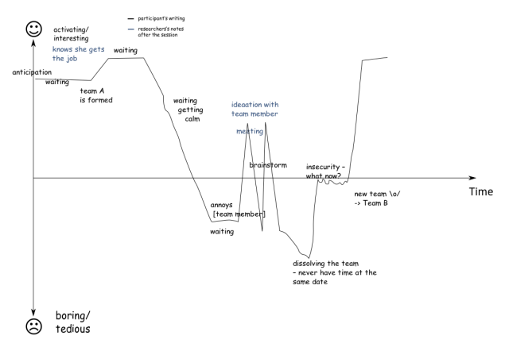
  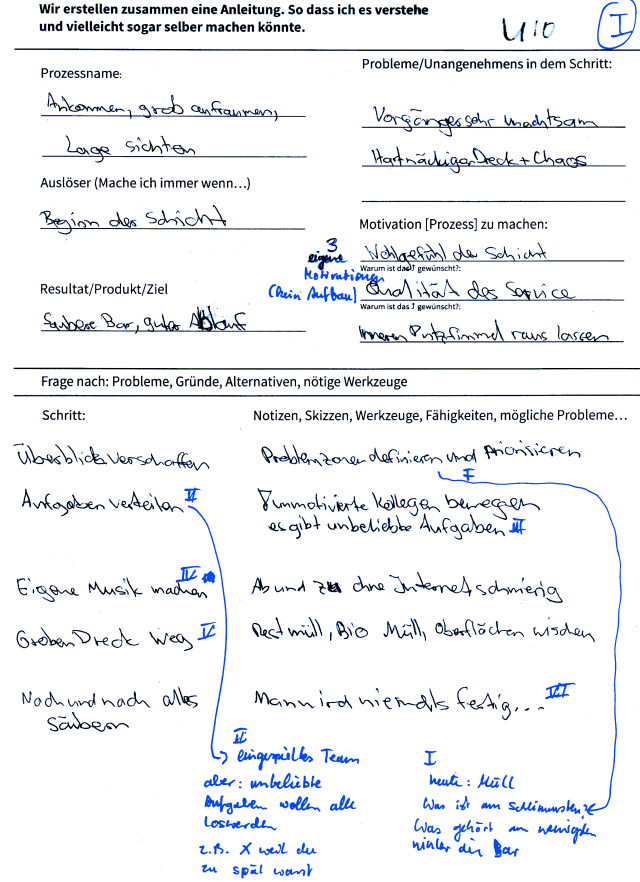
  <figcaption>Different templates as the result of a research session</figcaption>

Wrap up the current activity and introduce the next focus:

> I think this is a great overview of your day. You mentioned several tasks you do like […]. I would like to know more about them. I would put the diagram with what you find good or bad about the flow of your day aside for now and we know use a different template. I’ll briefly explain this to you…

You may transition between different themes several times. How long the whole research session takes depends on how many topics you cover and how much you go in depth and how many questions you ask. A very brief run with a general overview might take 20 Minutes. Though if you want to understand many activities in depth so that you know what actually is done a research session can take 1 or 2 hours.

When you covered all your topics close the current theme and go over all your diagrams again.

> I feel I got quite a good overview of your work. Before we finish, let me briefly sum up what I learned from you…

Go through the templates and summarize what you talked about. Don’t go into depth just recap it briefly. But if you notice that there a gaps and you did not fully understand something you can stop and ask.

When this is finished…

* Ask if the participant has questions to you
* Thank the participant for her/his time
* Give the incentive (if you have any)

As well explain what happens with the data:

> I will  gather some more data from a few other people. When I got to know about their work as well, I will start to analyse the data to find commonalities and differences regarding the works you do. I will identify typical problems and activities that could be supported better in the future. I and my team will create designs to do that and hopefully make your work more efficient and more enjoyable in the future.

After the debrief, supplement your notes (if you made any aside of the diagram) and supplement the diagram with information and clarification. Memory fade quickly and right after the research session you still remember much and can help your future self by adding annotations so you still can make sense of the data later.

##Analysis

### Annotations

In the analysis you will write annotations on the diagrams. For this, you can photocopy the diagrams and write on the copies. If you like to keep it digital, you can use any application which can add text over images (e.g. the free [inkscape](http://inkscape.org/). 

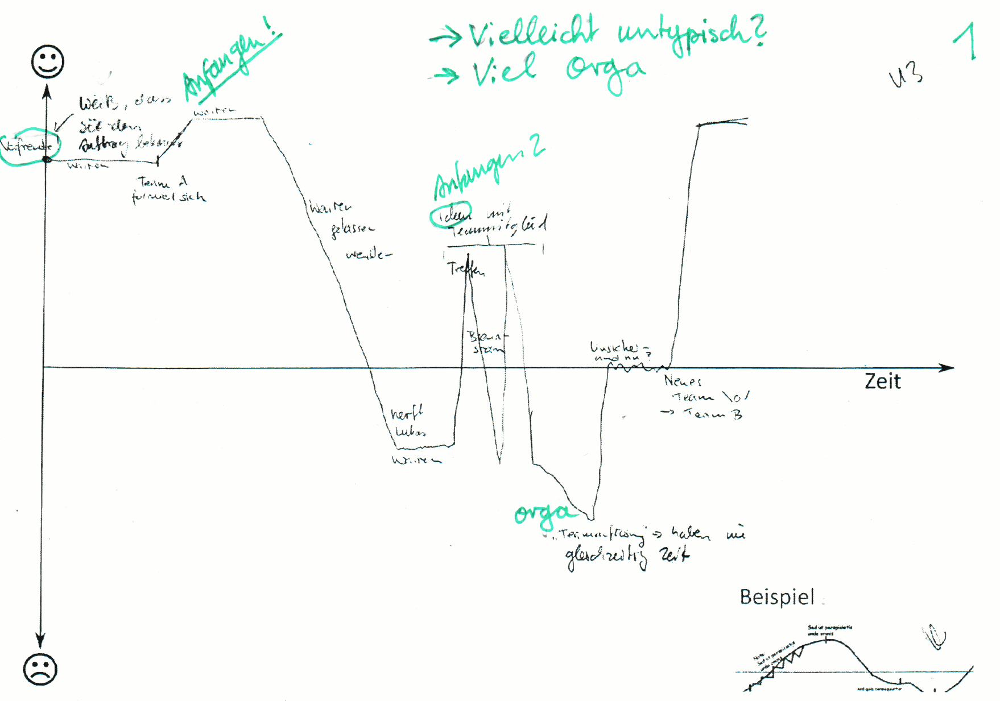

### Analyse by comparison

The most important tool for analysis are comparisions. You can start with doing comparisions as soon as you did two (graphical) interviews. 

Start by comparing the same type of diagram between different participants: How does the up and down of emotions differ between them? How does their workflow differ? Annotate the differences in the diagramms or write your analysis on a seperate sheet of paper Using this methods, you can find common patterns in your data. 

If you assume there is some pattern that is consistent between the diagrams, check if the pattern can be found in diagrams and notes of several participants and if there is any other information that contradicts it.

If you do further interviews, you can compare the new diagrams and notes with the diagrams and notes of previous interviews. As well, compare it with the current preliminary results of your analysis to see if you are able to support it with the new data or if the additional data might induce changes and improvements of your preliminary results.

You may also compare diagrams of the same participant in order to find any connections between the different perspectives: Are the people that lift up a participants mood also present in the diagram of social environment? What is the role of the collegue in the social envirionment diagram in the workflows? This makes your data more rich and helps to represent the interconnectedness of the diferent perspectives.

<!--
…by comparison
* Comparison between same diagrams, different participants
* Comparison between different diagrams, same participant. 
 -->

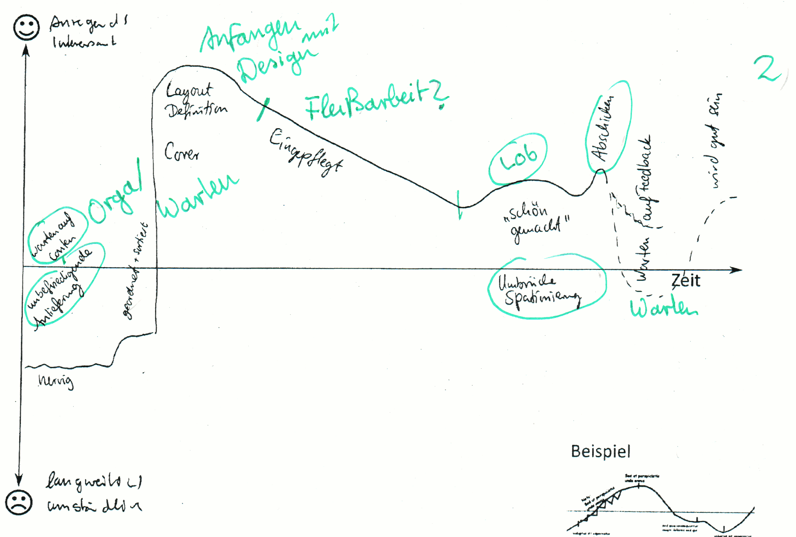
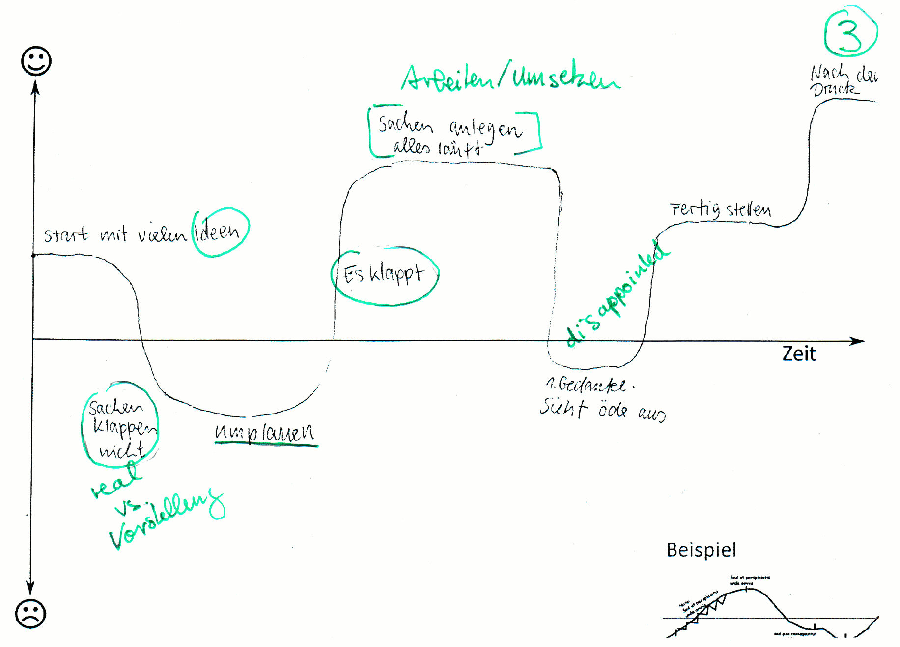
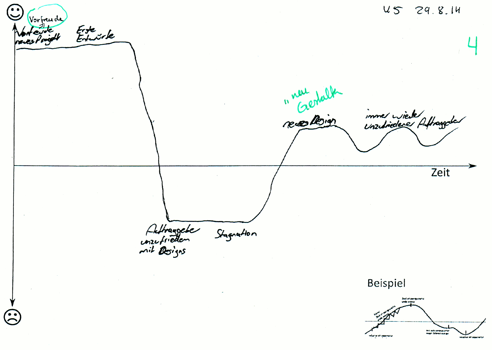
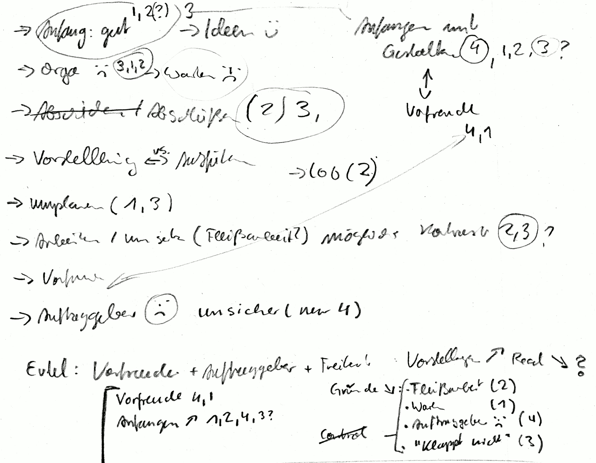

<!-- combine with notes --->

### Summarize

Create a visual summary of the data using informations which are consistent or similar across your participants’ diagrams and/or your other notes.

There is not one »ideal« representation for a visual summary of your participant’s diagram s and mappings. It should be data based but this does not mean that two people will create exactly the same visual summary out of the same data.

The visual summary may look much like the diagrams it is based on, but it is an artificial, visual summery. 

### Analysis examples:
<!-- the cafe theme should guide through the guide -->

After annotating these diagrams I searched for patterns and summarized them visually:

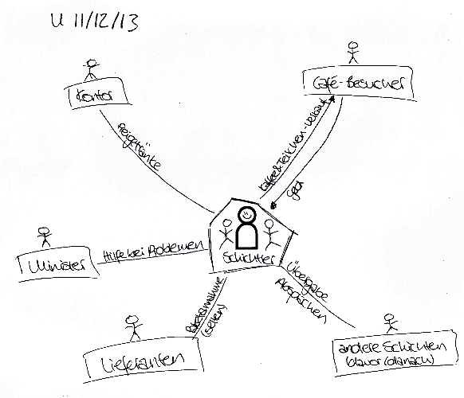
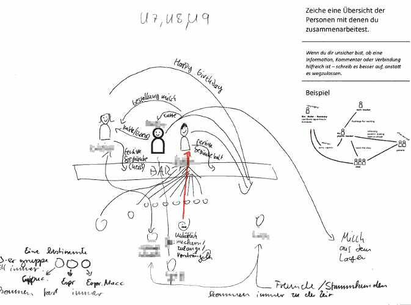
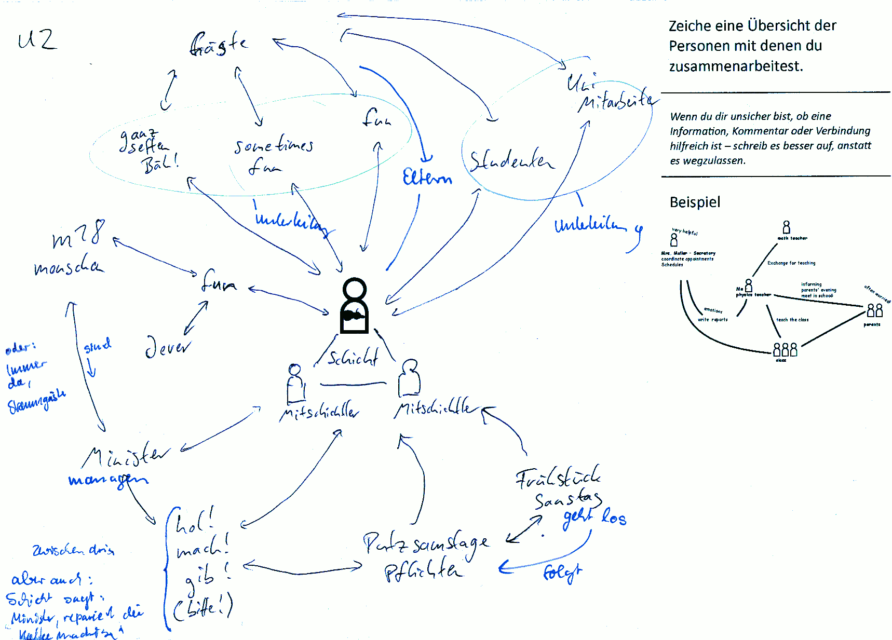
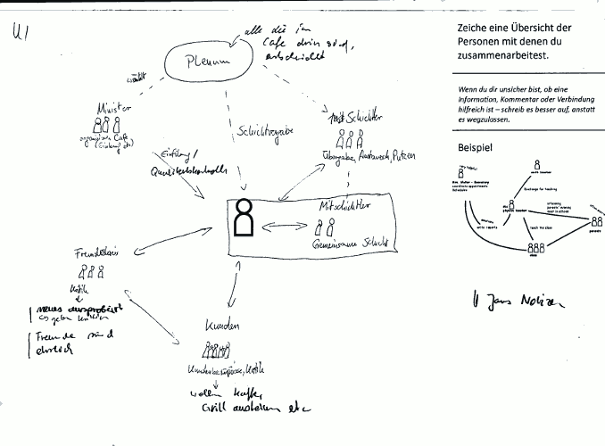

The visual summary with the consistent information from the different participants looked like this:

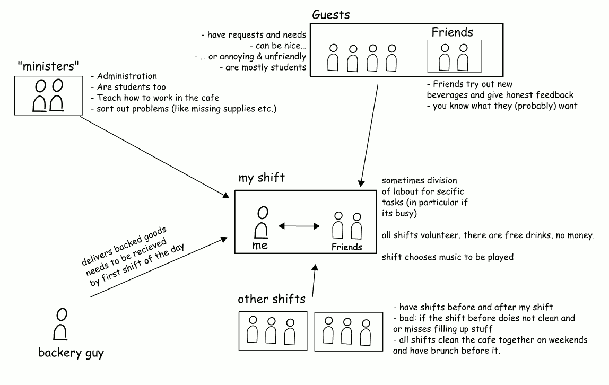

Though I emphasized consistency here, you can as well put contradictory or singular information in the summary. Just remember to write down of which nature these informations are to keep the research transparent for others and yourself.

### Analysis example 2

The following diagrams were drawn by designers who describe the process of working on freelance projects. The diagrams focused on what they liked or disliked in the process:

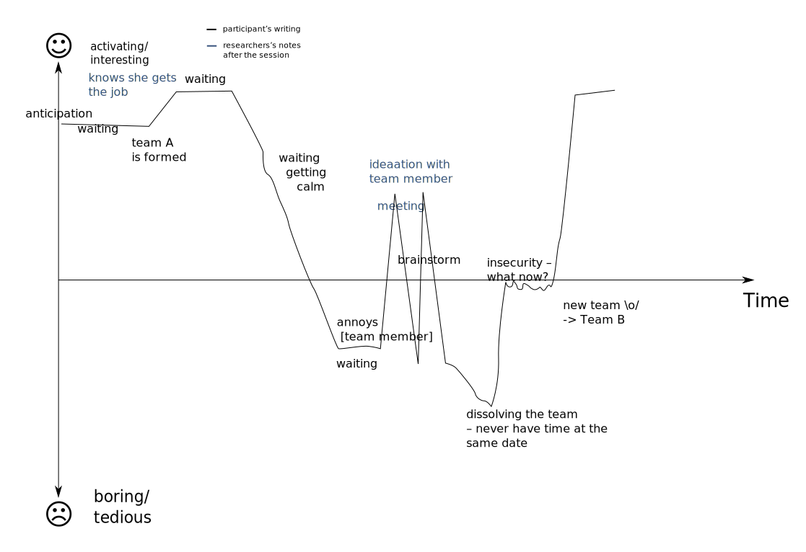

The result of the analysis is delivered as text in this case (i visual summary whould have been possibly too)

* In all but one diagram the onset of a project seems to be a good experience
* In three of the five diagrams there is a significant decline after the projects first, motivated phase. The reasons are: Seemingly unsolvable problems, project not going according to the plan and unhappy clients. A commonality is that the named reasons for the bad mood are seemingly out of the control of the participants.
* for all participants the project ends good, while four of them seem to be very happy at the end: Finishing seems to be a good experience.

\ 

* **Reasons for being happy**
	* project onset
	* ideation
	* design works like hoped or expected
	* project end

* **reasons for being unhappy**
	* »unsolvable problems«
	* client does not like the design
	* self critique
	* insufficient starting material

## Appendix

### Templates

**Downloads**

These templates provide a structure for frequent research interests. Below, in the how-to-section you can see filled out examples for these. The templates are available in English and German and can be customized by you, since they are saved in an open format (SVG) and are licensed under a [Creative Commons BY License](https://creativecommons.org/licenses/by/4.0/)

**English:** [Social Diagram](images/Menschen_zusammenarbeit_eng.svg) [Mood Graph](images/GutSchlechtZeit_Diagramm_eng.svg) [images/Aufgaben_eng.svg](Task List English)

**German:** [Social Diagram](images/Menschen_zusammenarbeit.svg) [Mood Graph](images/GutSchlechtZeit_Diagramm.svg) [images/Aufgaben.svg](Task List)

<!-- 
actual map
-->

#### Social Diagram
Ask to map the connections and tasks of people (and possibly devices) the participant works with. If participants ask if they may include something (e.g. books instead of only persons) encourage them to do it and use the additional data.

If they mention tools, devices and place, ask if you can see them, in case you are in the place they describe.

  <figure><figcaption>Template</figcaption></figure>
  <figure><a href="images/Bsp_Menschen_zusammenarbeit.svg">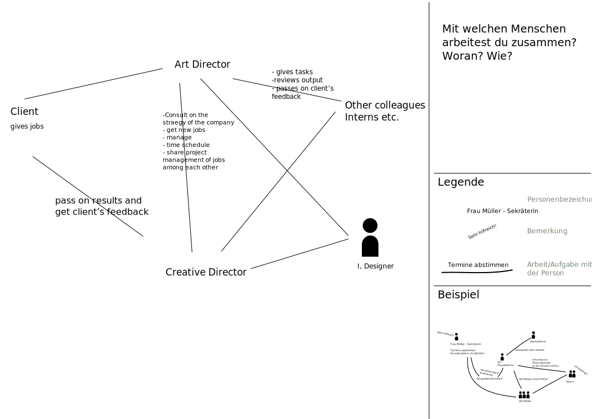</a><figcaption>Example</figcaption></figure>

#### Mood Graph
Ask your participants to draw the course of their feelings over a specific time and to annotate this graph.

   <figure><figcaption>Template</figcaption></figure>
   <figure><figcaption>Example</figcaption></figure>

#### Spacial Map

Ask the participant to draw a top-down-map and add details. The map could show e.g. the office and the participant is asked to draw devices, furniture etc. that are relevant for his/her work. You can start with a totally blank map or provide some scaffold. In the above example you could provide an archtectural floorplan with walls, windows and doors to relive the burden from the participant to figure this out. 

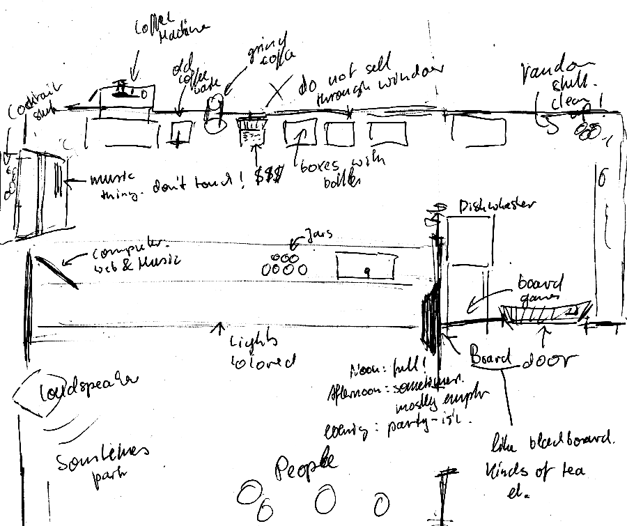

#### Task List and Describe Process
##### Step 1: List tasks

First we need an overview of what the participant does. Use the Task List (<a href="images/Prozessdiagram.svg">Deutsch</a>, <a href="images/Prozessdiagram_eng.svg">English</a>) for this and ask the participant to fill in his/her tasks.

##### Step 2: Document specific tasks

After having an overview of activities I choose the one (or several) that appear most relevant and ask the participant to document this activity(s) with me. I frame it as possible instructions which could be used to teach somebody else the activity.

Use the Process Description Template (<a href="images/Prozessdiagram.svg">Deutsch</a>,<a href="images/Prozessdiagram_eng.svg">English</a>) for this.

<figure><a href="images/Prozessdiagram_eng.svg">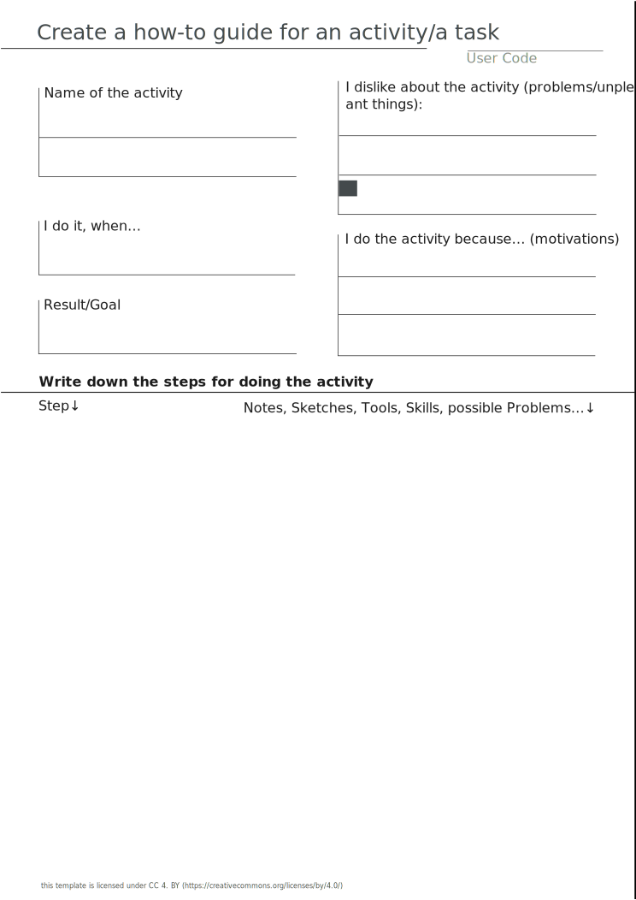</a><figcaption>Template</figcaption></figure>
<figure><a href="images/Bsp_Task.png">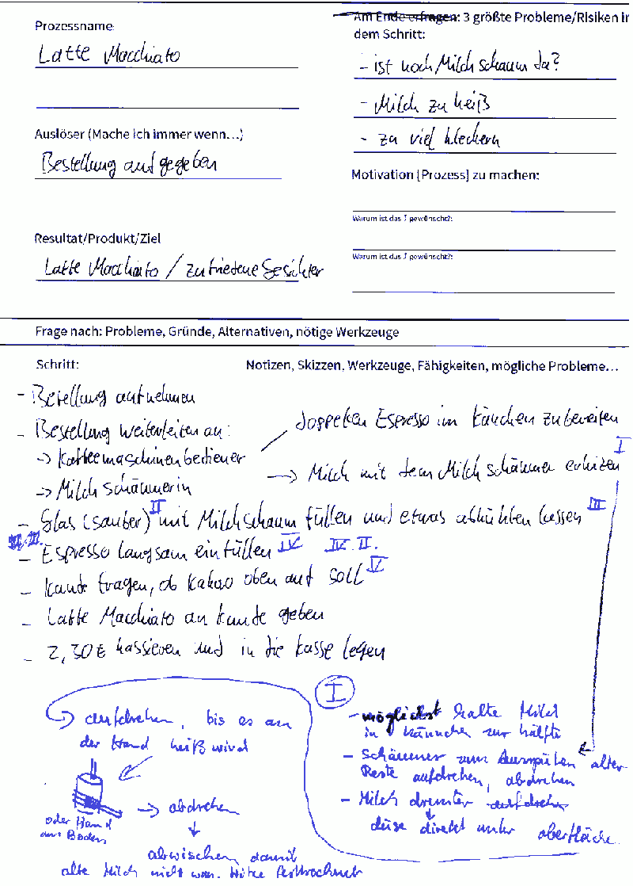</a><figcaption>Example</figcaption></figure>

When documenting the process, the participants usually only write down the general steps. After they are satisfied I go through their list and ask questions, like <em>You wrote »Distributing team work« – how do you do this?</em> or <em>This point »Let the milk cool down« – what happens if you skip this?</em>

In addition, I may ask for a demonstration.

I add the information I asked for as notes and sketches, either in another color or by creating references to another note sheet using (latin) numbers.

<!-- 
* Node-Link-Diagrams
* 

-->

### Create your own templates

Creating your own templates is not rocket science. However there are some things that you should keep in mind:

* It should be similar to a kind of diagram the participant already knows. The templates above correspond to forms like Mindmaps (for the social template), lists (for the Task List and Describe Process-template) and simple line graphs (the mood graph.)
* Include a small example on the template or on a different sheet of paper, so the participant knows how the result may look like. Just don’t use an example out of the domain you do research in.
* Iterate the templates and improve them during your research. If you meet problems with the template, design a new, hopefully improved version before doing the next research session. The templates above have gone through several iterations which concerned the example (It had »Lorem Ipsum« on it, and some asked why this is in latin), the wording of the headline and the combination of fields in the templates (the mood graph did originally not have the »is good:«/»is bad:«-Lists at the bottom)

### Literature
* Sanders, Liz, and Pieter Jan Stappers. *Convivial design toolbox: generative research for the front end of design*. BIS, 2012.

* Literat, Ioana. »A Pencil for Your Thoughts«: Participatory Drawing as a Visual Research Method with Children and Youth. International Journal of Qualitative Methods 12 (2013): 84-98.

If you want to learn about interviewing and research:

* [Beginner’s Guide To User Needfinding](http://jdittrich.github.io/userNeedResearchBook/)

Some other mapping methods which are *not* concerned with collecting information, but organizing and displaying it. They provided inspiration for the visual methods described here: 

* [Customer Journey Mapping](http://www.smashingmagazine.com/2015/01/15/all-about-customer-journey-mapping/) (Smashing Magazine)
* [Business Model Canvas](https://en.wikipedia.org/wiki/Business_Model_Canvas) (Wikipedia) 
* [Service Design Blueprint](https://en.wikipedia.org/wiki/Service_blueprint) (Wikipedia)

Sketchnotes look similar to the participant’s visualizions since they combine diagramming, sketches and text. In contrast, Sketchnotes are not based on templates and intended (personal) note keeping. [Examples of sketchnotes can be found on sketchnotearmy](http://sketchnotearmy.com/)

### License

 Visual User Need Research by <a xmlns:cc="http://creativecommons.org/ns#" href="fordes.de" property="cc:attributionName" rel="cc:attributionURL">Jan Dittrich</a> is licensed under a <a rel="license" href="http://creativecommons.org/licenses/by/4.0/">Creative Commons Attribution 4.0 International License</a>.

### Footnotes
[^questionsUmoquit]: Umoquit (2011) notes that some participants express difficulties of discomfort when asked to work with graphical methods.

[^Harold2015]: Harold, Rena D., Lucy R. Mercer, and Lisa G. Colarossi. "Eco maps: A tool to bridge the practice-research gap." J. Soc. & Soc. Welfare 24 (1997): 29.

[^Kesby2000]: Kesby, Mike. "Participatory diagramming as a means to improve communication about sex in rural Zimbabwe: a pilot study." Social science & medicine 50.12 (2000): 1723-1741.

[^Czuchry1995]: Czuchry, Michael, et al. "The use of node-link mapping in drug abuse counseling: The role of attentional factors." Journal of Psychoactive Drugs 27.2 (1995): 161-166.

[^Mattaini1993]:Mattaini, Mark A. More than a thousand words: Graphics for clinical practice. NASW Press, 1993.

[^Kalbach2016]: Kalbach, James. Mapping Experiences: A Complete Guide to Creating Value Through Journeys, Blueprints, and Diagrams. " O'Reilly Media, Inc.", 2016.

[^Nesbit2006]: Nesbit, John C., and Olusola O. Adesope. "Learning with concept and knowledge maps: A meta-analysis." Review of educational research 76.3 (2006): 413-448.

[^Chung1999]: Chung, G. K. W. K., Howard E. Herl, and Davina CD Klein. Knowledge mapping in the classroom: A tool for examining the development of students' conceptual understandings. Center for the Study of Evaluation, National Center for Research on Evaluation, Standards, and Student Testing, 1999.

[^Cassata2006]:Cassata, Amy E., and Lucia French. "Using concept mapping to facilitate metacognitive control in preschool children." (2006): 590-597.

[^Umoquit2011]: Umoquit, Muriah J., et al. "A multidisciplinary systematic review of the use of diagrams as a means of collecting data from research subjects: application, benefits and recommendations." BMC medical research methodology 11.1 (2011): 1.
